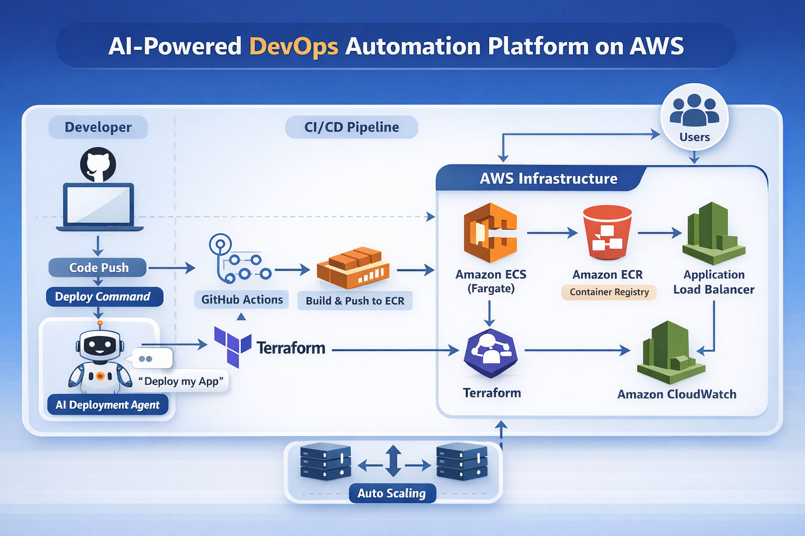

# 🚀 AI-Powered DevOps Automation Platform on AWS

## 🧠 Overview

This project is a **production-grade DevOps automation platform** that enables seamless application deployment using AWS cloud services and intelligent automation.

It simulates a real-world cloud environment with **CI/CD pipelines, container orchestration, Infrastructure as Code, monitoring, and AI-driven deployment automation**.

---

## 🏗️ Architecture



### 🔄 Flow

1. Developer pushes code to GitHub
2. GitHub Actions triggers CI/CD pipeline
3. Docker image is built and pushed to Amazon ECR
4. ECS (Fargate) pulls image and deploys container
5. Application Load Balancer distributes traffic
6. Auto Scaling adjusts containers based on load
7. CloudWatch monitors logs and metrics
8. AI Agent can trigger full deployment via command

---

## ⚙️ Tech Stack

* **Cloud:** AWS (ECS, ECR, ALB, CloudWatch)
* **Containerization:** Docker
* **CI/CD:** GitHub Actions
* **Infrastructure as Code:** Terraform
* **Monitoring:** CloudWatch
* **Programming:** Node.js, Python
* **AI Automation:** Python-based deployment agent

---

## 🔥 Features

### ✅ Containerized Application

* Dockerized Node.js application
* Consistent deployment across environments

### ✅ CI/CD Pipeline

* Automated build and deployment using GitHub Actions
* Push → Build → Deploy workflow

### ✅ Scalable Deployment

* ECS Fargate for serverless container orchestration
* No manual server management

### ✅ Load Balancing

* Application Load Balancer distributes traffic
* High availability and fault tolerance

### ✅ Auto Scaling

* Dynamic scaling based on CPU utilization
* Handles traffic spikes efficiently

### ✅ Monitoring & Logging

* CloudWatch logs and metrics
* Real-time debugging and observability

### ✅ Infrastructure as Code

* Terraform used to provision AWS resources
* Reproducible and version-controlled infrastructure

### ✅ AI Deployment Agent 🤖

* Accepts command: "Deploy my app"
* Automates:

  * Docker build
  * Image push to ECR
  * ECS deployment update

---

## 📁 Project Structure

```
ai-devops-platform/
│
├── app/                # Application code
├── agent/              # AI deployment agent
├── terraform/          # Infrastructure code
├── .github/workflows/  # CI/CD pipeline
├── README.md
```

---

## 🚀 Deployment Workflow

### 🔹 CI/CD Flow

```
Code Push → GitHub Actions → Build Docker Image → Push to ECR → Deploy to ECS
```

### 🔹 AI Automation Flow

```
User Command → AI Agent → Build → Push → Deploy → Live App
```

---

## 🌍 Live Application

Application is deployed using AWS ECS and accessible via Application Load Balancer.

---

## 🧠 Key Learnings

* Designing scalable cloud architecture
* Implementing CI/CD pipelines
* Managing containers with ECS
* Infrastructure provisioning with Terraform
* Monitoring production systems
* Automating deployments using AI concepts

---

## 🏆 Conclusion

This project demonstrates real-world DevOps practices including **automation, scalability, monitoring, and AI-driven workflows**, making it a complete production-level system simulation.

---

## 👨‍💻 Author

**Amal Antony**
